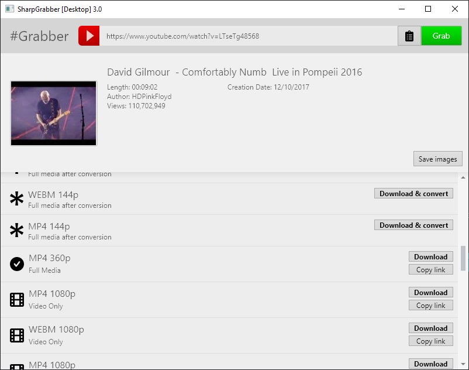

# SharpGrabber

This project consists of several connected sub-projects:            
- `SharpGrabber` is a *.NET Standard* library for crawling into top media provider websites such as **YouTube**, **Instagram** etc. in order to grab information and return direct links of the audio/video files.
- `SharpGrabber.Converter` is a *.NET Standard* library based on `ffmpeg` to join audio and video streams. This is particularly useful when grabbing high quality *YouTube* media that might be separated into audio and video files.
- `SharpGrabber.Desktop` A cross-platform desktop application
which utilizes both mentioned libraries to expose their functionality for desktop end-users.

### Supported Providers
The following providers are currently supported with the option
to easily add more or even override part of grabbing algorithm with your own code.

- YouTube
- Instagram

## Features
#### SharpGrabber Library
- Grabs useful information about media such as length, title, author and many more.
- Deciphers secure *YouTube* videos optionally.
- Extracts direct links to all available qualities.
- Extracts images and thumbnails.
- Supports *asynchronous* operations.

#### SharpGrabber.Desktop Application
- Displays information obtained by the `SharpGrabber` library and downloads the resolved direct links.
- Uses `SharpGrabber.Converter` to merge YouTube separated audio and video streams into complete media files.

## SharpGrabber Installation
Include *SharpGrabber* library in your own .NET projects.

### Install via NuGet
    Install-Package SharpGrabber -Version 1.1.0
    
## SharpGrabber Usage Example

### Download specifically from a provider

    var grabber = new InstagramGrabber();
    var result = await grabber.GrabAsync(new Uri("<Link to Instagram post>"));
    IList<IGrabbed> grabbedResources = result.Resources;

### Automatically detect provider and grab

    var grabber = MultiGrabber.CreateDefault();
    var result = await grabber.GrabAsync(new Uri("<Target Link>"));
    IList<IGrabbed> grabbedResources = result.Resources;

## SharpGrabber.Desktop
Requirements of the cross-platform desktop application to run and operate correctly: 
 - .NET Core 2.1 or higher (.NET Framework 4.6.1 or higher)
 - Shared libraries of *ffmpeg* copied into `ffmpeg` directory alongside app executable files for media conversion support.
   - On Windows, you may download the latest <a href="https://ffmpeg.zeranoe.com/builds/">Zeranoe ffmpeg build</a>.
 

## Roadmap
This project is very much in progress and the following features
are top priority:
- Support for Android
- Accelerate downloads in the desktop app (like a download manager)
- Support for more media providers

## Support
If you want to support this project, the best thing is to star it :)

## Contribution
To contribute to this project, I'd appreciate if you'd  help with adding support for
more top providers such as *Vimeo*, *DailyMotion* etc.

## License
Copyright &copy; 2019 Javid Shoaei 
All Rights Reserved &reg;

This project is licensed under the GNU Lesser General Public License (LGPL) version 3.

THIS SOFTWARE IS PROVIDED BY THE COPYRIGHT HOLDERS AND CONTRIBUTORS "AS IS" AND ANY EXPRESS OR IMPLIED WARRANTIES, INCLUDING, BUT NOT LIMITED TO, THE IMPLIED WARRANTIES OF MERCHANTABILITY AND FITNESS FOR A PARTICULAR PURPOSE ARE DISCLAIMED. IN NO EVENT SHALL THE COPYRIGHT OWNER OR CONTRIBUTORS BE LIABLE FOR ANY DIRECT, INDIRECT, INCIDENTAL, SPECIAL, EXEMPLARY, OR CONSEQUENTIAL DAMAGES (INCLUDING, BUT NOT LIMITED TO, PROCUREMENT OF SUBSTITUTE GOODS OR SERVICES; LOSS OF USE, DATA, OR PROFITS; OR BUSINESS INTERRUPTION) HOWEVER CAUSED AND ON ANY THEORY OF LIABILITY, WHETHER IN CONTRACT, STRICT LIABILITY, OR TORT (INCLUDING NEGLIGENCE OR OTHERWISE) ARISING IN ANY WAY OUT OF THE USE OF THIS SOFTWARE, EVEN IF ADVISED OF THE POSSIBILITY OF SUCH DAMAGE.
