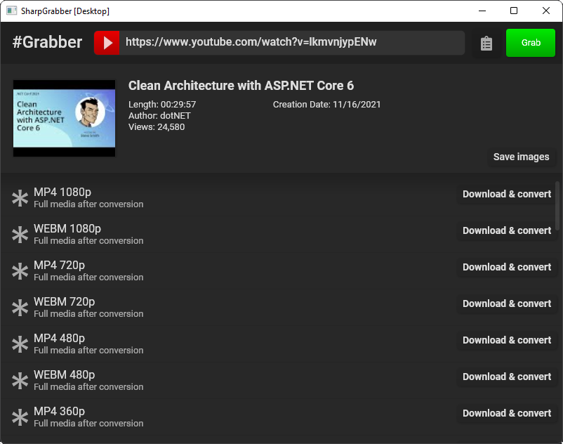

# SharpGrabber

[](https://github.com/dotnettools/SharpGrabber/blob/master/LICENSE)
[](https://www.nuget.org/packages/SharpGrabber)
[](https://github.com/dotnettools/SharpGrabber/actions/workflows/build.yml)

This repository contains multiple related projects:
- <a href="#how-to-use">`SharpGrabber`</a> is a *.NET Standard* library for scraping top media providers and grabbing high quality video, audio and information.
- <a href="#how-to-use">`SharpGrabber.Converter`</a> is a *.NET Standard* library based on `ffmpeg` shared libraries to join audio and video streams. This is particularly useful when grabbing high quality *YouTube* media that might be separated into audio and video files. It is also used for merging HLS stream segments.
- <a href="#introducing-blackwidow">`SharpGrabber.BlackWidow`</a> is a *.NET Standard* library for grabbing with JavaScript, which has many advantages over using scattered NuGet packages.
- <a href="#sharpgrabberdesktop">`SharpGrabber.Desktop`</a> A cross-platform desktop application which utilizes all three libraries mentioned above to expose their functionality to desktop end-users.

# How to Use
**⭐ Please give a star if you find this project useful!**

[Go to Documentation](https://github.com/dotnettools/SharpGrabber/wiki)

<details>
    <summary>
        Quick Start
    </summary>
    
## Package Installation
The `SharpGrabber` package defines abstractions only. The actual grabbers have their own packages and should be installed separately.

### <a href="https://www.nuget.org/packages/SharpGrabber/">SharpGrabber</a> - Core Package
    Install-Package SharpGrabber -Version 2.1

### <a href="https://www.nuget.org/packages/SharpGrabber.Converter/">SharpGrabber.Converter</a>
It's an optional package to work with media files. Using this package, you can easily concatenate video segments, or mux audio and video channels.
It uses `ffmpeg` shared libraries underneath.

    Install-Package SharpGrabber.Converter -Version 1.0

### <a href="https://www.nuget.org/packages/SharpGrabber.Hls/">HLS - M3U8 playlists</a>
This package adds the capability to parse M3U8 playlist files - including master playlists - and download video segments.
With the help of the `SharpGrabber.Converter` package, segments may be joined together.
This package also supports `AES-128` decryption.

    Install-Package SharpGrabber.Hls -Version 1.3

### <a href="https://www.nuget.org/packages/SharpGrabber.YouTube/">YouTube</a>
Adds support to download high-quality videos from YouTube, even if they are served as separate video and audio files only.
The high-quality output is possible thanks to the `SharpGrabber.Converter` library.

    Install-Package SharpGrabber.YouTube -Version 1.3

### <a href="https://www.nuget.org/packages/SharpGrabber.Vimeo/">Vimeo</a>
    Install-Package SharpGrabber.Vimeo -Version 1.0

### <a href="https://www.nuget.org/packages/SharpGrabber.Instagram/">Instagram</a>
Warning: This grabber is not guaranteed to work. It works only for clients that Instagram allows anonymous access to public content.

    Install-Package SharpGrabber.Instagram -Version 0.1

### <a href="https://www.nuget.org/packages/SharpGrabber.Adult/">Adult</a> - `PornHub`, `xnxx`, and `xvideos`

    Install-Package SharpGrabber.Adult -Version 1.0.2

## Quick Start
### 1. Start with building a Grabber

```csharp
var grabber = GrabberBuilder.New()
	.UseDefaultServices()
	.AddYouTube()
	.AddVimeo()
	.Build();
```
    
This will result in the creation of a "multi-grabber".

What grabbers you can "add" depends on what packages you've installed. In this example, we have installed YouTube and Vimeo packages.

### 2. Grab from a URI

```csharp
var result = await grabber.GrabAsync(new Uri("https://www.youtube.com/watch?v=LTseTg48568"));
```

No matter what website the URI refers to, the multi-grabber will detect the provider and put the right grabber to use.

### 3. Process the Result

```csharp
var info = result.Resource<GrabbedInfo>();
Console.WriteLine("Time Length: {0}", info.Length);
var images = result.Resources<GrabbedImage>();
var videos = result.Resources<GrabbedMedia>();
```

## Upgrade From 1.x to 2.x
ATTENTION! Beware of the breaking changes since v2.0 that requires you to update your code.
The good news is no functionality has been removed, so with a minor refactoring, you should be good to go!
I strongly recommend that you upgrade, v2 has a much cleaner structure and code.

</details>
        
## SharpGrabber.Desktop
### Version 4.5
- Grabs from every source supported by the official grabbers - that is, grabbers implemented in this Git repository.
- Displays information and downloads videos, audios, images etc.
- Merges YouTube separated audio and video streams into complete media files; as well as joining HLS segments!
- BlackWidow integrated

Requirements of the cross-platform desktop application to run and operate correctly: 
 - .NET Core 3.1
 - **Shared libraries** of *ffmpeg* copied into `ffmpeg` directory alongside app executable files for media manipulation support.
   - On Windows, you may download the latest <a href="https://github.com/BtbN/FFmpeg-Builds/releases">BtbN ffmpeg build</a>.
   - On any OS check out the <a href="https://ffmpeg.org/download.html">official website</a>.
 
 Download the latest binaries from the <a href="https://github.com/dotnettools/SharpGrabber/releases">releases page</a>.
    


# Introducing BlackWidow


BlackWidow executes scripts written specifically for grabbing, rather than relying on .NET assemblies.
- **Always Up-to-date:** The scripts are always kept up-to-date at runtime; so the functionality of the host application won't break as the sources change - at least not for long!
- **ECMAScript Support:** Supports JavaScript/ECMAScript out of the box.
- **Easy Maintenance:** *JavaScript* is quick to code and welcomes many developers. This helps contributors to quickly write new grabbers or fix the existing ones.
- **Secure**: The scripts are executed in a sandbox environment, and they only have access to what the BlackWidow API exposes to them.
- **Highly Customizable:** Almost everything is open for extension or replacement. Make new script interpreters, custom grabber repositories, or roll out your own interpreter APIs

<a href="blackwidow">Read more + Documentation</a>
    
## Contribution
You are most welcome to contribute!
- Authentication mechanisms for grabbers e.g. Instagram Login
- Support for more media providers such as *DailyMotion*, *Facebook*, *Twitch* etc.
- Accelerate downloads in the desktop app (like a download manager)

## Disclaimer
SharpGrabber library, BlackWidow and other projects and libraries provided in this repository are developed for educational purposes.
Since it's illegal to extract copyrighted data, you should make sure your usage of the tools provided here complies with copyright laws.
Contributors to these tools are not responsible for any copyright infringement that may occur per usage.

## License
Copyright &copy; 2022 SharpGrabber contributors<br />

This project is licensed under the GNU Lesser General Public License (LGPL) version 3.

THIS SOFTWARE IS PROVIDED BY THE COPYRIGHT HOLDERS AND CONTRIBUTORS "AS IS" AND ANY EXPRESS OR IMPLIED WARRANTIES, INCLUDING, BUT NOT LIMITED TO, THE IMPLIED WARRANTIES OF MERCHANTABILITY AND FITNESS FOR A PARTICULAR PURPOSE ARE DISCLAIMED. IN NO EVENT SHALL THE COPYRIGHT OWNER OR CONTRIBUTORS BE LIABLE FOR ANY DIRECT, INDIRECT, INCIDENTAL, SPECIAL, EXEMPLARY, OR CONSEQUENTIAL DAMAGES (INCLUDING, BUT NOT LIMITED TO, PROCUREMENT OF SUBSTITUTE GOODS OR SERVICES; LOSS OF USE, DATA, OR PROFITS; OR BUSINESS INTERRUPTION) HOWEVER CAUSED AND ON ANY THEORY OF LIABILITY, WHETHER IN CONTRACT, STRICT LIABILITY, OR TORT (INCLUDING NEGLIGENCE OR OTHERWISE) ARISING IN ANY WAY OUT OF THE USE OF THIS SOFTWARE, EVEN IF ADVISED OF THE POSSIBILITY OF SUCH DAMAGE.
