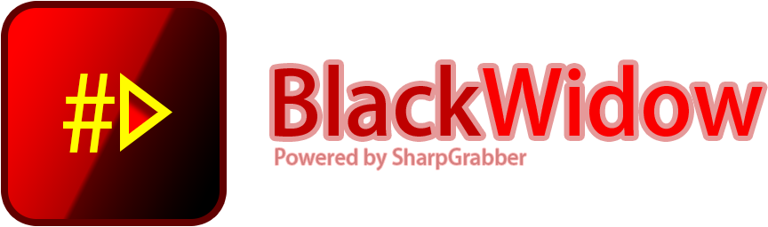

# BlackWidow

BlackWidow is a .NET library based on SharpGrabber. Rather than relying on .NET assemblies, BlackWidow executes scripts written specifically for grabbing.

## Why use BlackWidow?
BlackWidow gives you the following advantages over the traditional NuGet package approach:

- **Always Up-to-date:** The scripts are always kept up-to-date at runtime; so the functionality of the host application won't break as the sources change - at least not for long!
- **ECMAScript Support:** Supports JavaScript/ECMAScript out of the box.
- **Easy Maintenance:** *JavaScript* is darn easy to write and understand! This helps contributors to quickly write new grabbers or fix the existing ones.
- **Secure**: The scripts are executed in a sandbox environment, and they only have access to what the BlackWidow API exposes to them.
- **Highly Customizable:** Almost everything is open for extension or replacement. Make new script interpreters, custom grabber repositories, or roll out your own interpreter APIs

## How does it work?

BlackWidow keeps a collection of scripts locally - called the local repository.
Each script gets interpreted as an object implementing `IGrabber`.
To keep the scripts up-to-date, a remote repository is constantly monitored as the single source of truth.

<a href="https://github.com/dotnettools/SharpGrabber/wiki/04-BlackWidow">Installation / Documentation</a>

<a href="https://github.com/dotnettools/SharpGrabber">&lt;- Back to Home Page</a>
